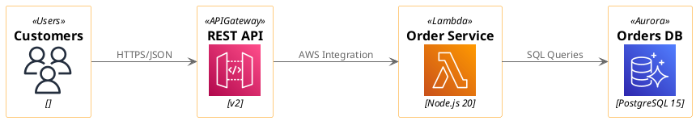
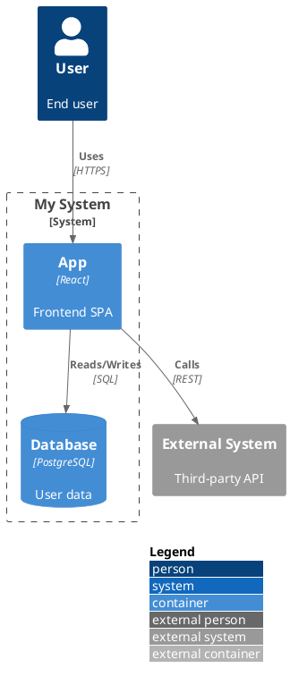

# Architecture Documentation Skill

Generate comprehensive technical architecture documentation from codebases with embedded diagrams.

## Overview

This skill helps Claude Code analyze a codebase and produce in-depth technical documentation suitable for:
- **Engineers:** Implementation details, algorithms, failure handling
- **Architects:** System design, component interactions, trade-offs
- **Stakeholders:** High-level context, business goals
- **PMs:** System capabilities, constraints, decisions

**Focus:** Depth over breadth. Documents the "why" behind technical decisions, not just the "what."

## Quick Start

### 1. Generate Documentation

```bash
# In Claude Code, provide your codebase and invoke the skill:
# "Generate architecture documentation for this codebase"
```

Claude will:
1. Explore the codebase structure
2. Identify components and dependencies
3. Trace data flow through the system
4. Generate comprehensive documentation with PlantUML diagrams
5. Output a markdown file with cloud architecture diagrams embedded

### 2. Render Diagrams

After Claude generates the documentation:

```bash
# Render all diagrams via Kroki API (free, no API key needed)
./render-kroki-diagrams.js path/to/Architecture.md --format svg

# Replace diagram code blocks with image references
./render-kroki-diagrams.js path/to/Architecture.md --format svg --replace

# Use self-hosted Kroki instance
./render-kroki-diagrams.js path/to/Architecture.md --base-url http://localhost:8000
```

Or render a single diagram manually:

```bash
curl -X POST https://kroki.io/plantuml/svg \
  -H "Content-Type: text/plain" \
  -d '@startuml
!include <awslib/AWSCommon>
!include <awslib/Compute/Lambda>
!include <awslib/Storage/SimpleStorageService>
Lambda(myLambda, "Handler", "Process events")
SimpleStorageService(myS3, "Data Bucket", "Store files")
myLambda --> myS3
@enduml' -o diagram.svg
```

## Diagram Engine: Kroki.io

This skill uses **Kroki.io** — a unified REST API that wraps 25+ diagram engines (PlantUML, D2, Mermaid, etc.) behind a single endpoint.

- **API:** Simple POST with plain text, returns SVG/PNG
- **Cloud Icons:** Full AWS/Azure/GCP via PlantUML stdlib
- **Free:** ~100 requests/minute on public instance; self-host via Docker for unlimited
- **Output:** SVG, PNG, JPEG, PDF

### Self-Hosting Kroki

```bash
# Quick start (PlantUML, GraphViz, D2, etc.)
docker run -p8000:8000 yuzutech/kroki

# Full stack with Mermaid support
docker compose up -d   # using docker-compose.yml from kroki-syntax.md
```

### Kroki Endpoints

| Diagram Type | Endpoint |
|-------------|----------|
| PlantUML with cloud icons | `POST /plantuml/svg` |
| C4 model diagrams | `POST /c4plantuml/svg` |
| Mermaid | `POST /mermaid/svg` |
| D2 | `POST /d2/svg` |
| GraphViz | `POST /graphviz/svg` |

## Documentation Template

The generated documentation follows this structure:

```
1. Context & Scope
   - Business goals
   - System context diagram (PlantUML)

2. Architecture Constraints & Principles
   - Why this approach?
   - Immutable rules

3. High-Level Architecture
   - Container diagram (C4 model or cloud icons)
   - Data flow walkthrough with transformations

4. Component Deep Dives (for each component)
   - Purpose
   - Implementation details (stack, algorithms, dependencies)
   - Engineering analysis (trade-offs, configuration rationale, edge cases)
   - Component diagram

5. Cross-Cutting Concerns
   - Observability
   - Failure modes
   - Deployment

6. Decision Log
   - Major decisions with context and consequences
```

## PlantUML Diagram Syntax

Claude generates diagrams using PlantUML with cloud icon macros:



### C4 Model Diagrams



## Render Script Options

| Option | Description | Default |
|--------|-------------|---------|
| `--output-dir <dir>` | Output directory for diagrams | `./diagrams` |
| `--format <format>` | Output format: `svg` or `png` | `svg` |
| `--replace` | Replace code blocks with image refs | `false` |
| `--base-url <url>` | Kroki instance URL | `https://kroki.io` |

The script auto-detects C4 diagrams (by checking for `!include <C4/...>`) and routes them to the correct `/c4plantuml/` endpoint.

## Reference Materials

### 1. **example-output.pdf**
Gold standard example showing the expected documentation quality and structure.

### 2. **kroki-syntax.md**
Complete syntax reference including:
- Kroki API usage (POST/GET, encoding, rate limits, self-hosting)
- PlantUML architecture diagram syntax (nodes, groups, connections, styling)
- Cloud icon include paths (AWS, Azure, GCP, K8s — all via PlantUML stdlib)
- C4 model macros (Person, System, Container, Component, Deployment)
- Layout control, skinparam, tips and troubleshooting

### 3. **icon-reference.md**
Comprehensive cloud icon catalog:
- 900+ AWS icons with exact macro signatures (Lambda, EC2, S3, Aurora, etc.)
- 400+ Azure icons (AzureFunction, AzureCosmosDb, AzureKubernetesService, etc.)
- GCP icons (Cloud_Functions, CloudRun, BigQuery, CloudSQL, etc.)
- Kubernetes icons (KubernetesPod, KubernetesSvc, KubernetesDeploy, etc.)
- General-purpose icons (tupadr3 Font Awesome, DevIcons, Material Design)

### 4. **diagram-examples.md**
10 real-world diagram examples with complete PlantUML code:
- AWS three-tier web application
- Microservices with event-driven architecture
- Data ETL pipeline
- Serverless event-driven architecture
- C4 container diagram with AWS icons
- C4 system context diagram
- Multi-region high availability
- Azure microservices
- CI/CD pipeline
- C4 deployment diagram

## Key Features

- **Cloud-native diagrams:** AWS/Azure/GCP icons rendered as proper architecture diagrams
- **C4 model support:** System context, container, component, and deployment diagrams
- **Free rendering:** No API key needed — Kroki.io public instance handles ~100 req/min
- **Self-hostable:** Docker one-liner for unlimited rendering
- **Detailed transformations:** Shows exact input → output at each stage
- **Library rationale:** Documents WHY each dependency was chosen
- **Configuration explanations:** Explains WHY specific values are set
- **Trade-off analysis:** Discusses alternatives and why they were rejected
- **Failure handling:** Documents edge cases, retries, fallbacks
- **Concrete examples:** Real payloads, actual code snippets

## Adapting for Other Projects

This skill is codebase-agnostic and works with:
- **Backend services:** Node.js, Python, Go, Java, etc.
- **Frontend apps:** React, Vue, Angular
- **Full-stack applications**
- **Microservices architectures**
- **Monolithic applications**

The skill infers structure from common patterns (package.json, requirements.txt, go.mod, etc.).

## Tips for Best Results

1. **Provide context:** Include README, business requirements, or design docs in the codebase
2. **Point to entry points:** Mention main files (e.g., "main.py is the entry point")
3. **Highlight complexity:** Tell Claude which components are most complex
4. **Request specific focus:** "Focus on the authentication flow" or "Deep dive on the data pipeline"
5. **Iterate:** Review generated docs and ask Claude to expand specific sections

## Architecture Decision

This skill prioritizes **depth for engineers** because:

1. **Translation is easier:** Engineers can simplify technical docs for stakeholders, but stakeholders can't add missing technical depth
2. **Structured review:** Technical documentation enables proper code review and architecture validation
3. **Onboarding:** New engineers need deep technical context to contribute effectively
4. **Maintenance:** Future modifications require understanding the "why" behind decisions

High-level summaries can be generated from detailed docs, but the reverse is not possible.
