# Rendering Architecture Docs to DOCX

## Overview

Single-pass Python script that converts architecture markdown with diagram code blocks into a polished Word document. Diagrams are rendered via Kroki API and embedded as PNG images.

## When to Use

- Architecture docs need to be shared as Word documents
- Stakeholders require formal document artifacts (not markdown)
- Documents contain PlantUML, C4, Mermaid, D2, or other Kroki-supported diagrams
- Compliance/audit requires document format output

**Not for:** Markdown-only workflows, PDF-only output (use pandoc), diagram-only rendering (use `render-kroki-diagrams.js`)

## Quick Reference

```bash
# Basic usage
python render-docx.py Architecture.md

# Custom output path
python render-docx.py Architecture.md -o report.docx

# Self-hosted Kroki
python render-docx.py Architecture.md --kroki-url http://localhost:8000

# Corporate template
python render-docx.py Architecture.md --template company.dotx

# Narrower images
python render-docx.py Architecture.md --image-width 5.0
```

| Option | Description | Default |
|--------|-------------|---------|
| `-o, --output` | Output DOCX path | `<input>.docx` |
| `--kroki-url` | Kroki instance URL | `https://kroki.io` |
| `--image-width` | Max image width (inches) | `6.0` |
| `--template` | Optional `.dotx` template | None |

## Dependencies

```
python-docx>=1.1.0
requests>=2.31.0
mistune>=3.0.0
Pillow>=10.0.0
```

Install: `pip install -r requirements.txt`

## Diagram Detection

Any Kroki-supported diagram type is detected from the code fence tag:

````markdown

```plantuml
@startuml
...
@enduml
```



```c4plantuml
@startuml
!include <C4/C4_Container>
...
@enduml
```

```d2
x -> y -> z
```
````

**Untagged blocks:** Code blocks without a tag but containing `@startuml` are auto-detected. If the block includes C4 markers (`!include <C4/...>`, `C4_Context`, `C4_Container`, etc.), it routes to `/c4plantuml/png`. Otherwise `/plantuml/png`.

**Supported types:** plantuml, c4plantuml, mermaid, d2, graphviz, dot, ditaa, blockdiag, seqdiag, actdiag, nwdiag, packetdiag, rackdiag, bpmn, bytefield, excalidraw, nomnoml, pikchr, structurizr, svgbob, tikz, umlet, vega, vegalite, wavedrom, wireviz.

## Figure Captions

Captions follow this priority chain:

| Priority | Source | Example |
|----------|--------|---------|
| 1 | HTML comment in code block | `<!-- caption: System Context -->` |
| 2 | PlantUML diagram name | `@startuml System Context` |
| 3 | Preceding heading text | `### System Architecture` |
| 4 | Fallback | `Diagram 1`, `Diagram 2`, ... |

Output format: **Figure N: Caption Text**

## Document Structure

The script produces:

1. **Title page** — extracted from first `# H1` heading, centered
2. **Table of Contents** — Word field code (right-click → Update Field in Word)
3. **Body** — all markdown content with:
   - Headings (H1–H4) → Word Heading 1–4 styles
   - Paragraphs with **bold**, *italic*, `code`, [links](url)
   - Diagram code blocks → rendered PNG images with figure captions
   - Non-diagram code blocks → monospace styled text
   - Tables → Word tables with blue header row
   - Lists → Word bullet/number list styles
   - Block quotes → Intense Quote style
   - `---` horizontal rules → **page breaks**

## Page Breaks

Use `---` (thematic break / horizontal rule) in markdown to insert page breaks:

```markdown
## Section 3

Content here...

---

## Section 4

New page starts here...
```

## Kroki API

The script sends raw diagram code as `Content-Type: text/plain` POST:

```
POST /{diagram_type}/png HTTP/1.1
Content-Type: text/plain

@startuml
...
@enduml
```

**C4 endpoint:** Diagrams with C4 markers go to `/c4plantuml/png`, not `/plantuml/png`.

**Error handling:** Fail fast. Any Kroki render error stops the script immediately with the error message.

## Template Support

Pass a `.dotx` template to apply corporate styles:

```bash
python render-docx.py doc.md --template corporate.dotx
```

The template's styles (fonts, colors, heading formats) will apply. The script adds custom styles (Figure Caption, Code Block) only if they don't already exist in the template.

## Common Mistakes

| Mistake | Fix |
|---------|-----|
| Untagged diagram renders as code block | Add fence tag: ` ```plantuml ` or ensure `@startuml` is present |
| C4 diagram renders incorrectly | Verify the block has `!include <C4/...>` or tag it `c4plantuml` |
| Images too wide/small | Adjust `--image-width` (default 6.0 inches) |
| TOC is empty in Word | Right-click TOC → Update Field → Update Entire Table |
| SVG not supported | Script uses PNG — Word's SVG support is inconsistent across versions |
| Tables render as plain text | Mistune v3 requires `plugins=["table"]` — the script enables this automatically |
| Kroki rate limited | Self-host: `docker run -p8000:8000 yuzutech/kroki` and use `--kroki-url` |
